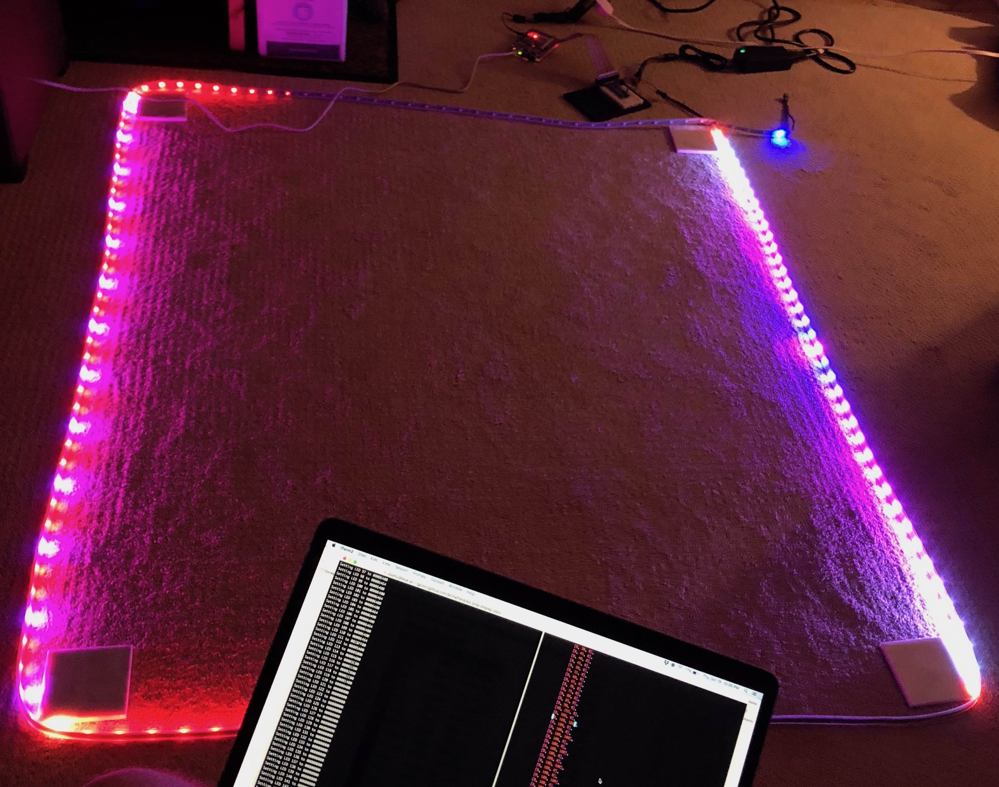

# LED-Strip-Display

A UI and service for interacting with a WS2812B-based LED strip via a Raspberry pi.

### Early prototype

### Notes

This software was built around the concept of wrapping a window frame with an addressable LED strip. In order to ease interactions with the strip, it also includes a React-based webui and an Echo-based backend web service.

Please note that this software is currently very purpose-built. The following are some constraints on the current implementation:

* The WebUI layout exactly matches the dimensions (in addressable LED pixels, of course) of my front window
* The service is designed to run on a Raspberry Pi and use the PWM channel
* It is built and run on Ubuntu 16.04, working around limitations in the Linux kernel via the PWM channel
* The PWM library for LED strips can be difficult to build (see here: https://github.com/jgarff/rpi_ws281x/issues/234 )

However, the React component based design should allow folks to realign the Edges with the number of pixels they find most appropriate (adjusting the serialization approach as well).